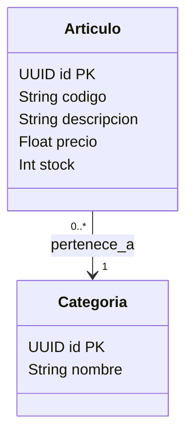

# Documentación Técnica — Gaci

## Propósito
Explicar cómo se implementa y conecta un sistema mediante contratos de API, arquitectura, datos y trazabilidad técnica.

## Cuándo usar
Activar al diseñar o modificar APIs, esquemas, integraciones, arquitectura, infraestructura o documentación de una solución.

## Entradas esperadas
Componentes afectados, contratos, modelo de datos, flujo, dependencias, cambios y referencia de GEM si existe.

## Reglas obligatorias
- Documentar APIs nuevas con OpenAPI 3.0 y payloads tipados.
- Representar relaciones y flujos complejos con Mermaid, PlantUML o imágenes vectoriales.
- Mantener nomenclatura técnica coherente con el proyecto.
- Registrar cambios significativos de esquemas, dependencias o contratos.

## Procedimiento
1. Identificar componentes, límites y flujo de datos.
2. Definir o actualizar contratos de API y modelos.
3. Actualizar diagramas y decisiones relevantes.
4. Verificar que la documentación refleja la implementación actual.

## Salida esperada
Documento técnico accionable, con contratos y diagramas suficientes para implementar, revisar y mantener la solución.

## Restricciones
No reemplazar una especificación estructurada por una explicación textual cuando el contrato pueda expresarse en YAML/JSON.

## Ejemplos

Este módulo define las instrucciones y estándares para generar y mantener la documentación técnica de los proyectos de Gaci. Esta documentación describe el **CÓMO** se implementa el sistema a nivel arquitectónico, de datos e infraestructura.

---

## Referencia de formato
Usar las siguientes plantillas como detalle de implementación de las reglas operativas anteriores. La documentación debe explicar conexiones, flujos, datos y APIs con el nivel necesario para implementar, revisar y mantener la solución.

## 2. Estructura de Especificación de API (OpenAPI / Swagger)
Toda comunicación entre el Frontend y el Backend debe estar tipada y documentada usando el estándar **OpenAPI 3.0**. La IA debe generar la especificación YAML/JSON de cada endpoint nuevo.

### Ejemplo de Generación de Endpoint
```yaml
paths:
  /api/v1/articulos/{id}:
    get:
      summary: Obtener detalles de un artículo por ID
      tags: [Artículos]
      parameters:
        - name: id
          in: path
          required: true
          schema:
            type: string
            format: uuid
      responses:
        '200':
          description: Artículo encontrado
          content:
            application/json:
              schema:
                $ref: '#/components/schemas/ArticuloResponse'
        '404':
          description: Artículo no encontrado
```

## 3. Modelado de Datos (Diagramas de Entidad-Relación)
La documentación de la base de datos debe estar compuesta por diagramas Mermaid que reflejen la estructura actual de las tablas, relaciones y claves foráneas, facilitando la comprensión del modelo de dominio.

### Ejemplo de Diagrama Mermaid


## 4. Gestión de Versiones y Cambios (Integración con GEM)
Si existe un evento o ticket GEM, toda modificación técnica significativa (cambios en esquemas de base de datos, nuevas dependencias o ruptura de contratos de API) debe quedar registrada allí como evento técnico. Si no existe GEM, no se inventa un identificador.

* **Descriptores de Commit Técnicos:** Utilizar el prefijo `chore:`, `refactor:` o `build:` en los commits de Git para que la IA pueda extraer los cambios de infraestructura y, cuando exista GEM, generar la entrada de changelog correspondiente.
* **Diagramas de Evolución:** Mantener el diagrama Mermaid actualizado en el README o en la documentación de la tarea de GEM antes de merge a `develop`.

## 5. Reglas de Estilo para Documentación Técnica
1. **Nomenclatura técnica clara:** Utilizar camelCase para JSON y snake_case o PascalCase para modelos de base de datos según el ORM elegido.
