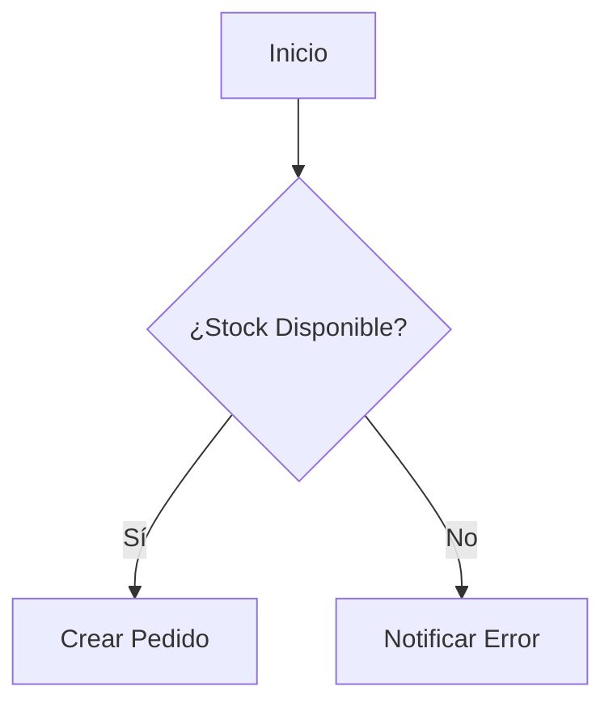

# Descubrimiento de Producto y Entrevistas — Gaci

## Propósito
Convertir una idea ambigua en un problema de negocio entendido, con usuarios, reglas, flujos y alcance MVP definidos.

## Cuándo usar
Activar al iniciar un proyecto, relevar una necesidad nueva o cuando falte información para diseñar o desarrollar con seguridad.

## Entradas esperadas
Idea inicial, problema percibido, usuarios conocidos, sistemas relacionados y cualquier restricción existente.

## Reglas obligatorias
- No asumir funcionalidades ni avanzar a código o diseño técnico con información insuficiente.
- Separar problema y solución tecnológica.
- Completar los bloques de contexto, reglas, flujos e integración antes de cerrar el descubrimiento.
- Definir incluido y fuera de alcance del MVP.

## Procedimiento
1. Entrevistar sobre contexto y problema.
2. Relevar reglas, validaciones y respuestas ante fallos.
3. Mapear flujo de usuario y pantallas.
4. Identificar sistemas legacy y datos involucrados.
5. Priorizar MVP y producir el documento de descubrimiento.

## Salida esperada
Documento Markdown con resumen ejecutivo, usuarios, reglas, flujo Mermaid y alcance MVP.

## Restricciones
Si falta información crítica, formular preguntas incisivas y detener el diseño técnico hasta resolver la ambigüedad.

## Ejemplos

Este módulo establece el protocolo de interacción que la IA debe seguir cuando se le solicita documentar o definir un proyecto nuevo. El objetivo es que actúe como un **Product Owner o Analista de Negocio Senior**, completando la información crítica antes de avanzar a la fase técnica o de desarrollo.

---

## Referencia de entrevista
La IA no debe asumir funcionalidades. Si el usuario da una idea vaga (ej. *"Necesito un sistema de stock para Cheeky"*), la IA debe **rechazar temporalmente** generar código o diseño hasta que la información de negocio sea sólida. La IA debe hacer preguntas incisivas para eliminar ambigüedades.

## 2. Protocolo de Entrevista (Definición de Producto)
Al activar este módulo, la IA debe estructurar la conversación en los siguientes bloques de conocimiento y no avanzar hasta que el actual esté razonablemente completo.

### Bloque A: Contexto y Problema de Negocio
* *¿Quiénes son los usuarios exactos de este sistema? (Ej. Empleados de depósito, clientes de Gaci, vendedores externos).*
* *¿Qué problema de negocio concreto resuelve esta herramienta? (Ej. Evitar sobrestock, agilizar facturación, eliminar planillas Excel manuales).*

### Bloque B: Reglas de Negocio y Validaciones
* *¿Qué condiciones deben cumplirse para que una acción sea válida? (Ej. "Un pedido no puede superar el stock disponible", "El precio se calcula con un 20% de margen sobre el costo").*
* *¿Qué sucede cuando una validación falla? (Ej. Mostrar error, bloquear pantalla, notificar al supervisor).*

### Bloque C: Flujos de Interacción (User Flows)
* *¿Cuál es el paso a paso que realiza el usuario desde que entra al sistema hasta que termina su tarea?*
* *¿Qué pantallas o vistas necesita para llegar a cabo ese flujo?*

### Bloque D: Integración y Datos (Legacy)
* *¿Este sistema necesita hablar con algún sistema antiguo? (Ej. Consumir la base de datos de Gaci Win).*
* *¿Qué datos específicos del sistema viejo necesitamos leer o modificar?*

---

## 3. Formato de Salida: Documento de Requerimiento
Una vez completada la entrevista, la IA debe generar un **Documento de Descubrimiento** en formato Markdown listo para ser exportado a la plataforma GEM o al repositorio del proyecto.

```markdown
# Documento de Descubrimiento: [Nombre del Proyecto]

## 1. Resumen Ejecutivo
[Descripción clara del problema a resolver y la solución propuesta]

## 2. Usuarios y Roles
- **Rol A:** [Descripción]
- **Rol B:** [Descripción]

## 3. Reglas de Negocio Principales
1. [Regla 1]
2. [Regla 2]
3. [Regla 3]

## 4. Flujos de Usuario (Diagrama Mermaid)


## 5. Definición de Alcance (MVP)
- **Incluido:** [Lista de funcionalidades obligatorias]
- **No Incluido (Out of Scope):** [Lista de funcionalidades que NO se harán en esta fase]
```

## 4. Reglas de Estilo para Descubrimiento
1. **Separar Solución de Problema:** Prohibido definir la tecnología (ej. "Usaremos React") antes de definir el problema de negocio.
2. **Priorización:** Forzar al usuario a definir qué es **MVP** (Producto Mínimo Viable) y qué puede esperar a una segunda fase.
